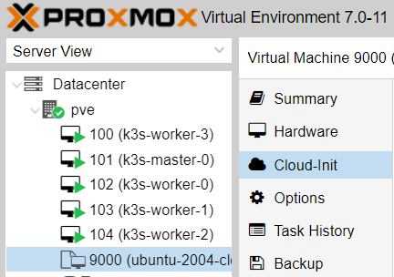

# Build a Kubernetes cluster using k3s/k8s on Proxmox

This is my implementation of https://github.com/NatiSayada/k3s-proxmox-terraform-ansible and should help you get started on k3s/k8s with proxmox. You can specify the number of Master nodes and worker nodes using the config file then let Terraform do the work.

## System requirements

* Terraform installed
* Proxmox server

### Proxmox setup

This setup is relaying on cloud-init images.

Using cloud-init image save us a lot of time and it's work great!
I use ubuntu focal image, you can use whatever distro you like.

to configure the cloud-init image you will need to connect to a Linux server and run the following:

install image tools on the server (you will need another server, these tools cannot be installed on Proxmox)

Create the SSH keys and move them to proxmox
```bash
ssh-keygen -t rsa -b 4096 -C "admin@example.com" -f ~/.ssh/proxk3s
scp ~/.ssh/proxk3s* Proxmox_username@Proxmox_host:~/.ssh/
```

```bash
apt-get install libguestfs-tools
```

Get the image that you would like to work with.
you can browse to <https://cloud-images.ubuntu.com> and select any other version that you would like to work with.
for Debian, got to <https://cloud.debian.org/images/cloud/>.
it can also work for centos (R.I.P)
```bash
wget https://cloud-images.ubuntu.com/focal/current/focal-server-cloudimg-amd64.img
```

update the image and install Proxmox agent - this is a must if we want terraform to work properly.
it can take a minute to add the package to the image.
```bash
virt-customize -a focal-server-cloudimg-amd64.img --install qemu-guest-agent
```

now that we have the image, we need to move it to the Proxmox server.
we can do that by using `scp`
```bash
scp focal-server-cloudimg-amd64.img Proxmox_username@Proxmox_host:/path_on_Proxmox/focal-server-cloudimg-amd64.img
```

so now we should have the image configured and on our Proxmox server. let's start creating the VM
```bash
qm create 9000 --name "ubuntu-focal-cloudinit-template" --memory 2048 --net0 virtio,bridge=vmbr0
```

for ubuntu images, rename the image suffix
```bash
mv focal-server-cloudimg-amd64.img focal-server-cloudimg-amd64.qcow2
```

import the disk to the VM
```bash
qm importdisk 9000 focal-server-cloudimg-amd64.qcow2 local-lvm
```

configure the VM to use the new image
```bash
qm set 9000 --scsihw virtio-scsi-pci --scsi0 local-lvm:vm-9000-disk-0
```

add cloud-init image to the VM
```bash
qm set 9000 --ide2 local-lvm:cloudinit
```

set the VM to boot from the cloud-init disk:
```bash
qm set 9000 --boot c --bootdisk scsi0
```

update the serial on the VM
```bash
qm set 9000 --serial0 socket --vga serial0
```

Add the SSH key into the template
```bash
qm set 9000 --sshkey ~/.ssh/proxk3s.pub
```

Add a default user for the template
```bash
qm set 9000 --ciuser=root
```

Good! so we are almost done with the image. now we can configure our base configuration for the image.
you can connect to the Proxmox server and go to your VM and look on the cloud-init tab, here you will find some more parameters that we will need to change.


Great! so now we can convert the VM to a template and start working with terraform.
```bash
qm template 9000
```

### terraform setup

Rename the file `terraform/vars.sample` to `terraform/vars.tf` and update all the vars.
there you can select how many nodes would you like to have on your cluster and configure the name of the base image.
to run the Terrafom, you will need to cd into `terraform` and run:
```bash
terraform init
terraform plan
terraform apply
```

it can take some time to create the servers on Proxmox but you can monitor them over Proxmox.
it shoul look like this now:



You can use the auto generated host file for Ansible. To install k3s, I recommend the great work by https://github.com/itwars/k3s-ansible. If you are experimenting alot, create a sym link between `inventory/hosts.ini` and `k3s-ansible/inventory/my-cluster/hosts.ini` and set `ansible_user` in `group_vars/all.yml`.
